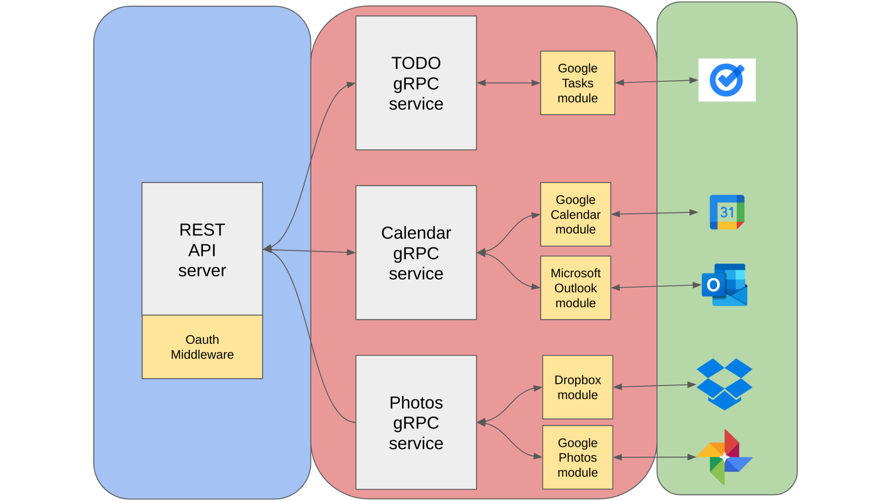
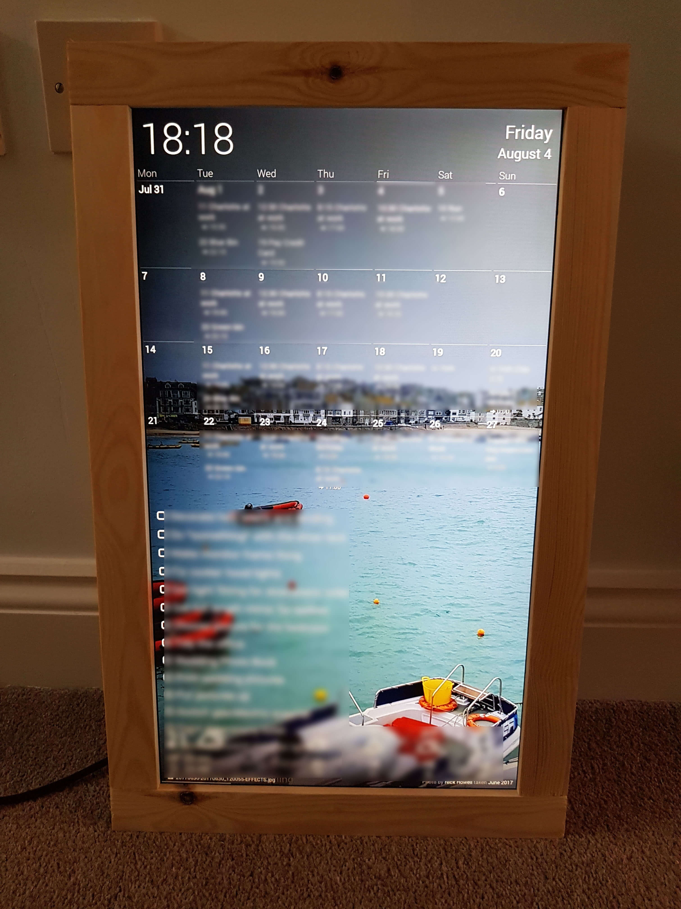

# SARA

******
Note: I'm working on this on the side wheenver I find the time to do so. Unfortunately it's not as much as I'd like. Needless to say, this project is very much in its infancies and will go through multiple iterations.
****

This project is intended to be an open source replacement for products like Google Nest Max and [Dakboard](https://dakboard.com/site). It's a modular server-based application that allows for easy extension of products and service while enalbing custom  home screen designs and client side applications.

In short, it is a service that aggregates all available APIs for products such as Google photos, Outlook, Dropbox, Tasks etc. It groups endpoints with respect to particular products. For example, a single endpoint to retrieve all your photos that exist across various platforms such as Google photos and dropbox. Or a single endoint to retrieve all your calendar events across Google Calendars, Outlook, and Yahoo. Want to add a service? Simply add a new module with the service endpoints and the feature service will compile it with all other existing services.

# Why Am I Doing This?
Easy, I got tired of buying products that I ultimately did not control or needed to pay a monthly subscription for. We all know how quickly Google adds and deprecates features. Or maybe you're tired of a poor user experience and thought to yourself "I could do this better". This project will not only allow myself to customize my home and personal assistant to my tastes, but it will also allow me to deploy it however I choose.

# The design

The design is intended to support as many platforms as possible. Instead of making it a web based or mobile app, I've decided on a server based application with exposed endpoints. The servers are lightweight and intended to be ran locally. They can however be migrated to the cloud if one chooses. This allows any platform to simply call the endpoints and render the information however they choose. Current inspirations are a Raspberry Pi powered touch screen like the Raspberry Pi project Dakboard.

The endpoints are exposed via a REST server written in Golang. The requests are then routed to individual gRPC servers in the backend. These too can be ran on the same Raspberry Pi, or individual Pis. These gRPC servers route the request to product specific modules that then call the product's exposed APIs, pull the data, and aggregate the results in a response back to the client.

# Tech Stack
* Golang
* Docker
* Redis
* Angular / React

# Current Implemented
* Authentication Authorization & Auditing (AAA)
  * Google Oauth 2.0 flow
* Google Photos
  * List all available albums
  * Retrieve media from specific albums

# Upcoming Features
* Google Calendar
* Google Tasks
  * Creating a TODO enabled endpoint
* Alexa & Google Assistant Integration
  * Voice enables features
* Chat GPT & Gemini Integration
  * Speech to Text for Chat GPT prompting and answers
* Nest Security Cam Integration
  * Rendering Live Camera Feeds
* Zoom Integration
  * Taking Real Time calls from the assistant servcie